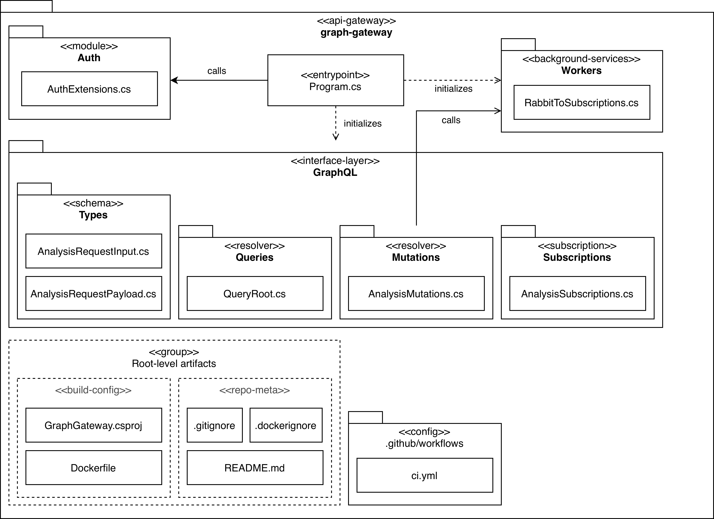
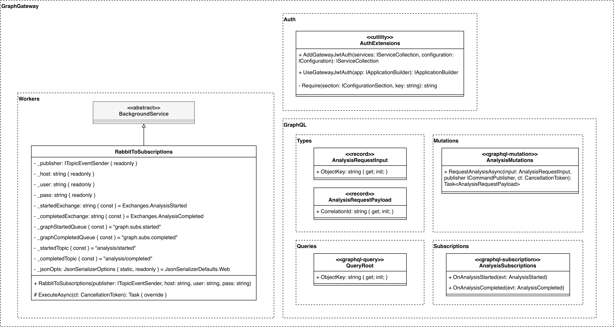

# GraphGateway
Microservice serving as the API facade and application gateway for the system. Provides a GraphQL API with queries, mutations, and subscriptions. Calls REST API `POST /uploads/start` and `POST /uploads/confirm` on **tu-ingestion-service**. Consumes `analysis.started` and `analysis.completed` events from RabbitMQ and forwards corresponding `analysis/started` and `analysis/completed` events to the onAnalysisStarted and onAnalysisCompleted GraphQL subscription fields.  

<!-- ---

## Codebase Architecture

---

## Design Class Diagram

 -->

---

See the [full system overview](https://github.com/team-2-devs/infra-core) in the **infra-core** repository.