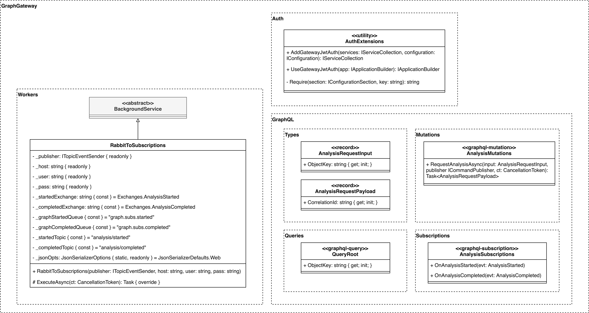

# GraphGateway
Microservice serving as the API facade and application gateway for the system. Provides a GraphQL API with queries, mutations, and subscriptions. Publishes `RequestAnalysis` commands to RabbitMQ and forwards `analysis/started` and `analysis/completed` events to the onAnalysisStarted and onAnalysisCompleted GraphQL subscription fields.

## Design Class Diagram

See the [full system overview](https://github.com/team-2-devs/infra-core)